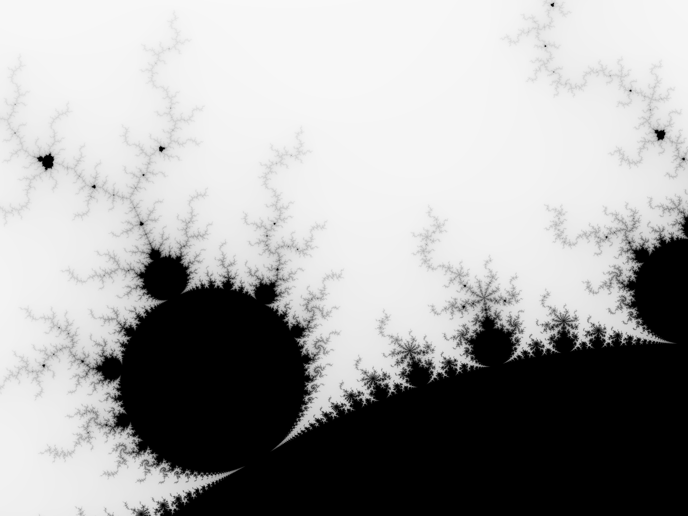

# 「Rust」 × 「マンデルブロ集合」

超軽量な次世代システムプログラミング言語、「**Rust**」を用いて高精度のマンデルブロ集合を描写します。  




# 環境情報

| 機能 | バージョン |
| ---- | ---- |
| Linux / Ubuntu | 20.04.5 |
| Rust | 1.63.0 |


# 環境構築


```bash
# イロイロ最新に
sudo apt update
sudo apt upgrade
```


## Rust インストール

```bash
curl https://sh.rustup.rs -sSf | sh
# インストール設定はデフォルト(1)で!!!
# 次に環境変数(PATH)を設定します。
export PATH="$HOME/.cargo/bin:$PATH"
# 最後に正しくインストール、パスの設定がされたか、以下のコマンドで確認します。
cargo --version
# -> cargo 1.63.0
rustc 1.63.0
# -> rustc 1.63.0
rustdoc --version
# -> rustdoc 1.63.0
```


## python インストール

```bash
sudo apt install python3
sudo apt install pip3
```

## 多倍長計算用のモジュールのインストール

```bash
# gccとかmakeとか諸々インストール
sudo apt install build-essential

sudo apt install m4 m4-doc
```

# 動画の作成

```bash
ffmpeg -r 30 -i seeds/★★★/%08d.png -vcodec libx264 -pix_fmt yuv420p -r 60 ./fruits/★★★.mp4
```

# 使い方

最初に.envファイルを生成します。  
トップレベルディレクトリ直下に配置して下さい。  


```.env
# カッコ内の数字は例です。

TARGET_DIRECTORY=★保存するディレクトリ名(a)★

START=★スタート(0)★
UPTO=★エンド(100)★

ASPECT_RATIO=★縦横比(1.5)★
SHRINK_RATIO = ★縮み率(0.9)★
FILESIZE_HEIGHT=★画像ピクセルの高さ(100)★
START_X = ★実軸の開始座標(-2)★
START_Y = ★虚軸の開始座標(1)★
DEFAULT_WIDTH = ★実軸の幅(3)★
DEFAULT_HEIGHT = ★虚軸の幅(2)★
```

以下のコマンドでテスト実行可能です。  


```
cargo run
```

本番用にビルド・実行する場合には以下のコマンドを実行します。

```bash
cargo build --release
./target/release/プログラム名(mandelbrot_rs)
```

プログラム名は「cargo.toml」の「package &gt; name」属性が対象です。  
自由に名前は変更できます。  


